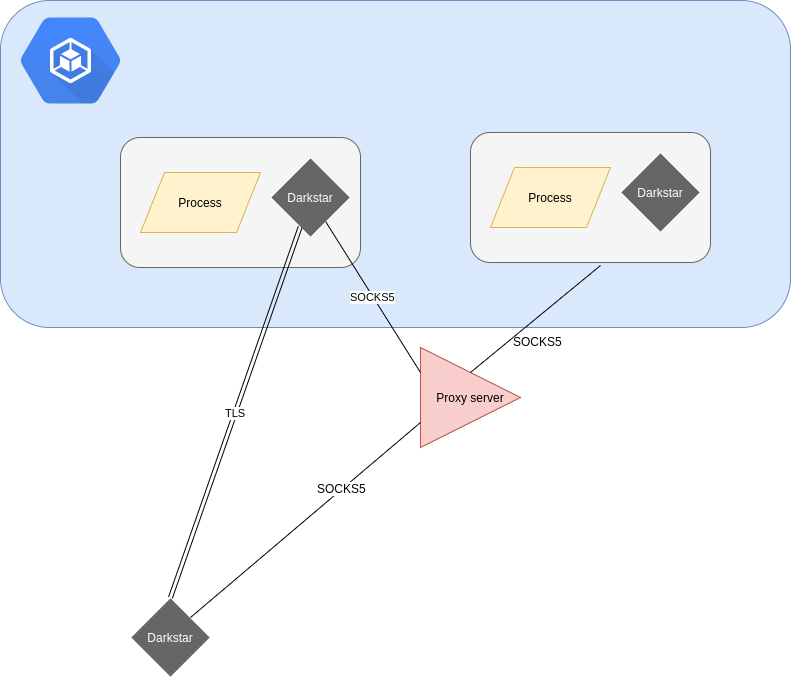

# darkstar



Command and control program in golang

- Rotates tls keys per run.
- TCP hole punching
- Arbitrary code execution (WIP)
- TLS or SOCKS5

# Requirements

A sqlite3 database for the server mode
e.g. `touch /usr/local/share/darkstar.db`
```

```


## Usage
`darkstar -mode=server -module=scavange -serverdbpath=/usr/local/share/darkstar.db`


`darkstar -mode=client -serverhostaddress=0.0.0.0`


| Client        | Direction     | Message Digest | Server        |
| ------------- | ------------- | -------------  | ------------- |
| Message       | ->            | ActorDetails  | Process incoming |
|               | <-            |                  ActorDetails + Instruction |
| Work          |               |               |                 |
| Message       | ->            | ActorDetails + Instruction + Payload  |                |


## Transport Modes

Enable SOCKS proxy on a server you control

`ssh -A -f -N -D  0.0.0.0:1080 root@localhost`

## Modules & development

The module system uses interfaces and it is easy to add your own modules in.

Modify firstly `loader.go` and secondly create your module .g. `unix/timestamp.go`
