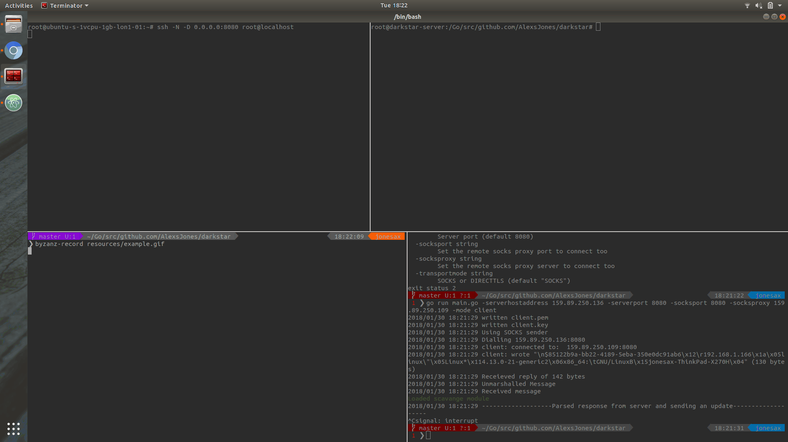
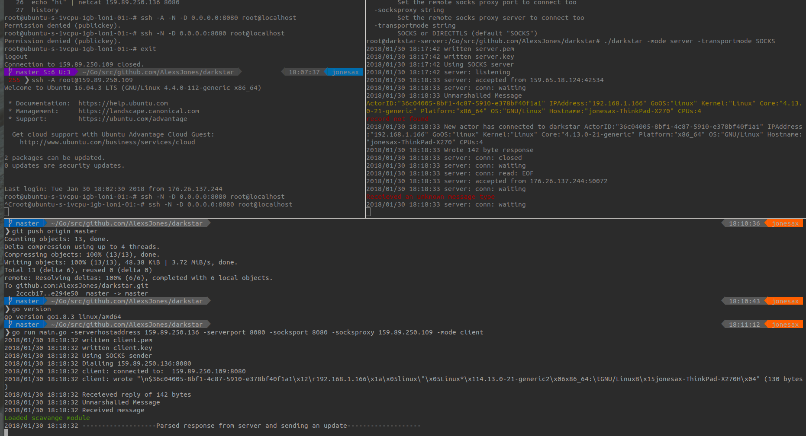

# darkstar

Command and control program in golang

- Rotates tls keys per run.
- TCP hole punching
- Arbitrary code execution (WIP)
- TLS or SOCKS5

# Requirements

- A sqlite3 database for the server mode e.g. `touch /usr/local/share/darkstar.db`
- Proxy SOCKS server `ssh -N -D 0.0.0.0:8080 root@localhost`

## Usage

### Direct TLS
`darkstar -mode=server -module=scavange -serverdbpath=/usr/local/share/darkstar.db`
`darkstar -mode=client -serverhostaddress=0.0.0.0`

### SOCKS5
`darkstar -mode server -transportmode SOCKS`
`darkstar -serverhostaddress 159.89.250.136 -serverport 8080 -socksport 8080 -socksproxy 159.89.250.109 -mode client`

| Client        | Direction     | Message Digest | Server        |
| ------------- | ------------- | -------------  | ------------- |
| Message       | ->            | ActorDetails  | Process incoming |
|               | <-            |                  ActorDetails + Instruction |
| Work          |               |               |                 |
| Message       | ->            | ActorDetails + Instruction + Payload  |                |

## Transport Modes

Enable SOCKS proxy on a server you control

`ssh -A -f -N -D  0.0.0.0:1080 root@localhost`

## Modules & development

The module system uses interfaces and it is easy to add your own modules in.

Modify firstly `loader.go` and secondly create your module .g. `unix/timestamp.go`
