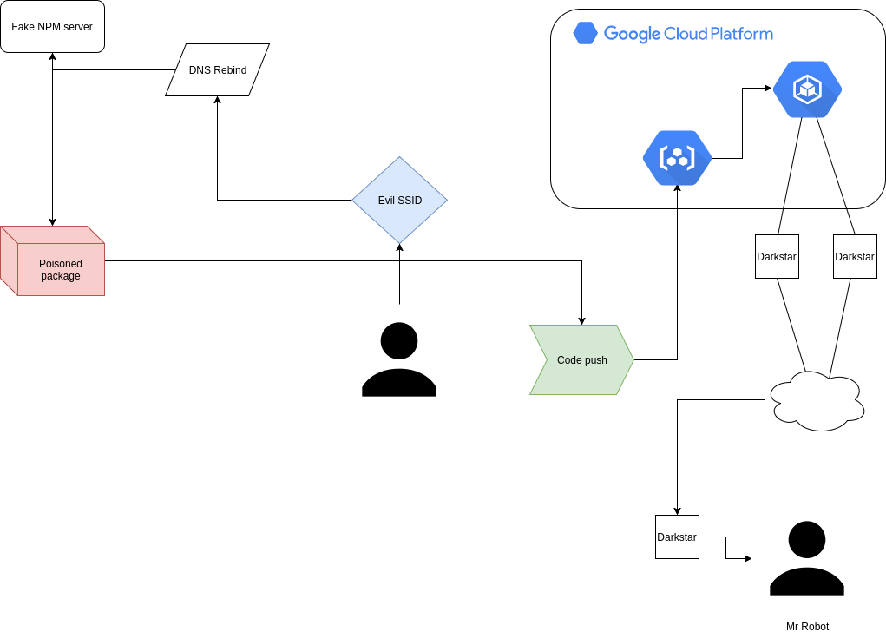

# darkstar



Command and control program in golang

- Rotates tls keys per run.
- TCP hole punching
- Arbitrary code execution (WIP)

# Requirements

A sqlite3 database for the server mode
e.g. `touch /usr/local/share/darkstar.db`
```

```


## Usage
`darkstar -mode=server -operation=scavange -serverdbpath=/usr/local/share/darkstar.db`
`darkstar -mode=client -serverhostaddress=0.0.0.0`


| Client        | Direction     | Message Digest | Server        |
| ------------- | ------------- | -------------  | ------------- |
| Message       | ->            | ActorDetails  | Process incoming |
|               | <-            |                  ActorDetails + Instruction |
| Work          |               |               |                 |
| Message       | ->            | ActorDetails + Instruction + Payload  |                |
